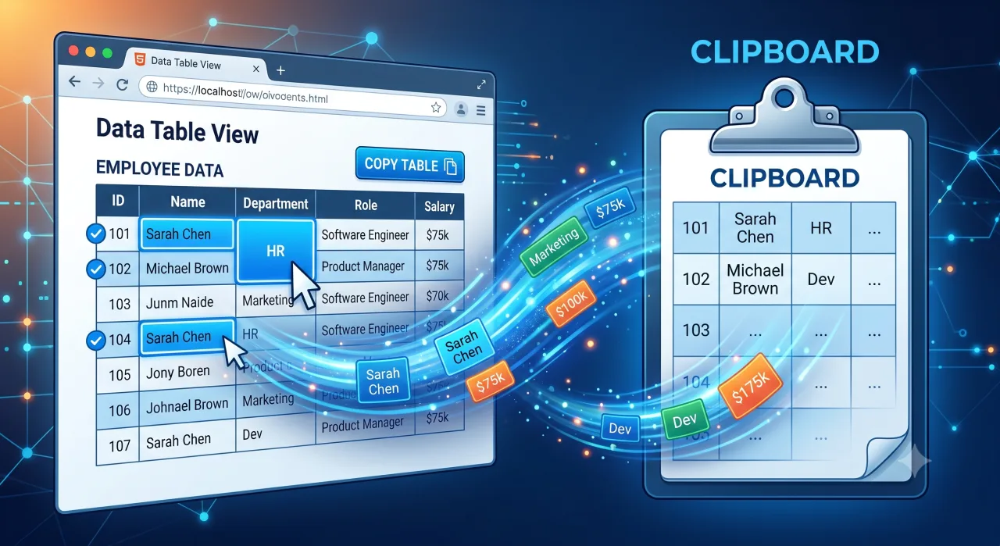

# Copytables



> ⚠️ **UNDER DEVELOPMENT** — this extension is being actively built and is not yet usable. The features below describe what is planned for the first release.

A Chrome extension for selecting and copying HTML table cells like a spreadsheet range — hold a modifier key and drag to select cells, columns, rows, or whole tables, then copy them as styled rich text, CSV, or tab-delimited text.

This is a from-scratch **Manifest V3** rewrite of an earlier, now-defunct extension. The original was an excellent tool but stopped working when Chrome disabled Manifest V2 extensions in 2025, and its core copy mechanism relied on a background-page DOM trick that has no equivalent under MV3's service-worker model. This project recreates the functionality on a clean MV3 foundation.

## Features

- **Modifier-key drag select** — hold a configurable modifier and drag to select cells, columns, rows, or entire tables, with auto-scroll on tall tables.
- **Copy formats:**
  - **As is** — rich HTML that pastes into Word/Docs looking like the on-screen table.
  - **CSV** — comma-delimited, properly quoted, with optional row/column transpose.
  - **TSV** — tab-delimited, with optional transpose, for Excel/Sheets.
  - Merged cells (`rowspan`/`colspan`) are preserved across all formats.
- **Infobox** — a floating count/sum/average/min/max summary of the numeric values in the current selection.
- **Configurable** — remap modifier keys and keyboard shortcuts; locale-aware number parsing (decimal/group separators) for the infobox.

## Platform

Chrome (Manifest V3) only for v1. Firefox/Edge support via the WebExtensions polyfill is a possible later addition.

## Install (load unpacked)

There's no Web Store listing yet, so install it manually from a local build.

1. **Build the extension** (requires [Node.js](https://nodejs.org/)):

   ```sh
   npm install
   npm run build
   ```

   This produces the loadable extension in the `dist/` folder.

2. **Load it in Chrome:**
   1. Open `chrome://extensions`.
   2. Turn on **Developer mode** (top-right toggle).
   3. Click **Load unpacked** and select the `dist/` folder.
   4. Copytables appears in your toolbar. Pin it from the puzzle-piece menu for quick access.

   On Chromium-based browsers (Edge, Brave, Opera) the steps are the same — open the browser's extensions page, enable developer mode, and load the `dist/` folder.

To update after pulling new changes, re-run `npm run build`, then click the **Reload** icon on the Copytables card in `chrome://extensions`.

## Credits

- Original concept and implementation: [Georg Barikin / gebrkn/copytables](https://github.com/gebrkn/copytables) (MIT License).
- This rewrite recreates that functionality for Manifest V3.

## License

MIT (matching the original).
